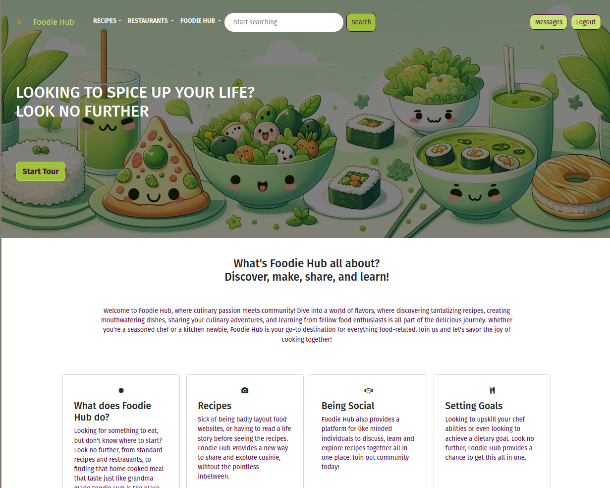

# Foodie Hub - CITS5505 Agile Web Development project

| Name               | Student Number | GitHub Username |
| ------------------ | -------------- | --------------- |
| Alexandra Harrison | 22581066       | allyharrison    |
| Kartik Bhalala     | 23244793       | kartikbhalala   |
| Neha Neha          | 23754739       | neha2007796     |
| Stevie Dahlin      | 22974467       | St-d603         |

## About The Project



Our website is all about food! FOODIE HUB is designed to be a one stop shop for all foodies.

Looking for something to eat? Look no further, Foodie Hub is a community where users can share their favourite recipes or even ask the community for recommendations. How about finding a new favourite place to eat? On Foodie Hub you can ask for suggestions, or visit our blog to find some Hidden Gems.

Looking for a recipe similar to one your Grandma made years ago but don't know where to start? Ask our Foodie Hub community to help you discover and make delicious flavours and meals!

Foodie Hub offers the chance to interact with like minded and taste-budded people alike. Check us out!

## How to run the project

To run the project locally, follow the instructions below to set up a `venv`, then `pip install` `requirements-dev` and then run flask.

```sh
# Activate virtual environment
python3 -m venv tmp-env
source tmp-env/bin/activate

# Install these dependencies for development
pip install -r requirements-dev.txt # (this will also install requirements.txt)

# OR install only these dependencies for production
pip install -r requirements.txt

# Apply migrations
flask db upgrade 8f09b1c4c9ea

# Launch container for search functionality
docker run --name elasticsearch -d --rm -p 9200:9200 --memory="2GB" -e discovery.type=single-node -e xpack.security.enabled=false -t docker.elastic.co/elasticsearch/elasticsearch:8.11.1

# Start app
flask run
```

If you would like to run with "livereload" for editing HTML/CSS, run `python local_dev.py` instead of calling `flask run`.
Note: This doesn't apply to changes to Python files.

```sh
python local_dev.py
```

# Tests

This directory contains the test files for the project.

## Test Files

-   `test_app.py`: This file contains the unit tests for the application.
-   `test_selenium.py`: This file contains the Selenium tests for the application.

## Running the Tests

Before running the tests, ensure you have the server running in the background, as well as the elasticsearch Docker container (see root README for instructions)

### Unit Tests

To run the unit tests, use the following command:

```sh
python3 -m unittest test_app.py
```

### Selenium Tests

To run the selenium tests, use the following command:

```sh
python3 ./test_selenium.py
```
